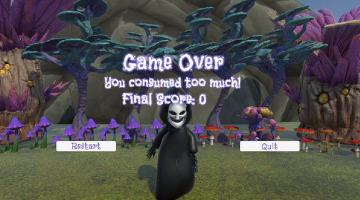

# CCL4 - Game "Don't Die High"
 
# 1. Logo

# 2. 🎮 Game Logic

This game is an infinite runner where the player navigates forward across a series of ground tiles, collecting items and avoiding obstacles to survive and achieve the highest score possible. The core mechanics are based on speed progression, obstacle avoidance, and item collection.

---

### 🚀 Core Gameplay Flow

- The player character **automatically runs forward**.
- The environment is made of **ground tiles** that continuously spawn as the player progresses.
- Each tile may randomly spawn:
  - **Obstacles** (e.g., walls, mushroom).
  - **Coins** to increase score.
  - **Heart collectibles** to restore lost lives.

---

### 🧍 Player Controls

- The player can:
  - **Switch between three lanes** (left, center, right).
  - **Jump** to avoid obstacles.
- **Falling off the ground** or **hitting an obstacle** results in losing a life.

---

### 💔 Health & Game Over Logic

- The player starts with **3 lives**, visually shown as heart icons.
- A life is lost when:
  - The player **collides with an obstacle** (e.g., wall or mushroom).
  - The player **falls off the ground**.
- The player can **restore one life** by collecting a **heart** (if lives are below 3).
- The game ends if:
  - The player **loses all 3 lives**.
  - The player's **score drops below 0** (from hitting obstacles).

---

### 💰 Score System

- Collecting a **coin** increases the score by **+1**.
- Hitting an obstacle deducts **−20 points** from the current score.
- If the score becomes **less than 0**, it's **game over**.
- The player's movement speed increases slightly as the score increases, making the game harder over time.

---

### 🔄 Restarting the Game

- On game over, the player is taken to a **Game Over** screen.
- From there, the player can:
  - **Restart** the game with full lives and zero score.
  - **Quit** the application to return to the `StartGame` scene.

# 3. Motivation
Don't Die High is a 3D endless runner where the player races along a colorful rainbow road through a psychedelic world. The aim is to survive and achieve a high score by collecting coins and hearts to restore lives. The player must avoid poisonous mushrooms and jump over walls — because each mistake costs a life. When a life is lost, Death begins to chase the player, adding tension. As the player runs, Death gradually falls behind and disappears — until the next mistake. Our motivation was to blend vibrant visuals, fast-paced action, and a subtle message: don't overdo it.

# 4. 3D Modeling and Animation

## 3D Models done by Blender
- Player  
    

- Animation Idle

- Animation Run

- Animation Jump

- Villain

  

 - Animation Run
  

  

- Environment

- Flower  

  

- Tree  

  

- RedMushroom  

  

- Obstacles

- Mushroom  

  
  
  

- Animation Idle
  

  
  
  

## Unity Asset Store
- 3D Gamekit - Environment Pack
    - Ground, mushroom, trees, rocks, and flowers used in the `StartGame` scene and `GameOver`
- FantasyEnvironments
    - Ground, mushroom, trees, rocks, and flowers used in the `StartGame` scene and `GameOver`

## free3d.com
- Magnet
- Heart

## Scenes

- Start Game, Main Game, Game Over scenes

  
  
  
  

# 5. Game Audio

This project uses **Audiokinetic Wwise** as the audio middleware, integrated with Unity, to provide advanced sound design and music management. Wwise enables flexible handling of soundbanks, events, and real-time audio control for both sound effects and music.

### Audio Workflow Summary
- **Wwise Integration:** Audio assets and events are managed in the Wwise Authoring Application and imported into Unity. Soundbanks are generated for each platform and kept in `ccl4_WwiseProject/GeneratedSoundBanks/`.
- **Triggering Sounds:** Sounds are triggered in Unity either by attaching Wwise components (such as `AkEvent`, `AkAmbient`, `AkAudioListener`, `AkGameObj`) to GameObjects, or by calling Wwise events from scripts using `AkSoundEngine.PostEvent("EventName", gameObject);`.
- **Adding/Modifying Audio:** To add or change sounds, import new audio files into the Wwise project, create or update events, regenerate soundbanks, and assign events in Unity as needed.
- **Music & Ambience:** Background music and ambience are managed through Wwise Music Segments and States, allowing for dynamic and interactive audio.

For a full guide to the audio pipeline, Wwise integration, and step-by-step instructions for adding or modifying sounds, **see [`AUDIO_IMPLEMENTATION.md`](AUDIO_IMPLEMENTATION.md)** in the project root.

# 6. System Design

## Overview

This Unity game features a modular design with distinct systems for player control, environment, collectibles, enemies, power-ups, and UI.

## Core Systems

### Player Movement (`PlayerMovement.cs`)

- Auto-runs, lane-switches, jumps using the Input System.
- Speed increases with coins collected.
- Restarts if player falls below y = -5.
- Uses Rigidbody and Animator.
- Updates GameManager for speed.

### Game Management (`GameManager.cs`)

- Singleton that tracks score (coins increase, obstacles decrease), lives (hitCount, max 3), and game state.
- Game over is triggered if `hitCount >= 3` or score <= 0.
- Updates UI elements (`TextMeshProUGUI`, `LivesUI`).
- Handles scene transitions.

### Tile Generation (`GroundSpawner.cs`, `GroundTile.cs`)

- Spawns tiles for an endless path.
- Tiles add obstacles (random positions) and coins.
- Tiles are destroyed after player passes.
- Uses colliders; GroundSpawner triggers GroundTile spawning.

### Collectibles (`Collectibles.cs`, `LifeHeart.cs`, `LifeHeartSpawner.cs`)

- Coins follow a random pattern, rotate, and add score.
- Life hearts spawn if `hitCount > 0` and restore life.
- Use collider triggers and are destroyed if behind player.
- Update GameManager accordingly.

### Power-Ups (`MagnetPowerup.cs`, `PlayerMagnet.cs`, `MagnetSpawner.cs`)

- Magnets spawn periodically and attract collectibles for 5 seconds.
- Use collider triggers and are destroyed if behind player.
- PlayerMagnet handles attraction logic.

### Obstacles (`Obstacle.cs`, `MovingObstacle.cs`)

- Static and moving obstacles increase `hitCount` and reduce score.
- Use colliders and notify GameManager on collision.

### UI (`LivesUI.cs`, `GameOverUI.cs`, `MainMenuUI.cs`, `SceneLoader.cs`)

- Displays lives (heart icons), score, final score, and menu options.
- Uses `Image`, `TextMeshProUGUI`, and `Button`.
- Driven by GameManager state.

### Camera (`CameraFollow.cs`)

- Tracks player with a fixed offset, locks x position at 0.
- Updated in `LateUpdate` to smooth movement.

### Villain (`VillainFollower.cs`)

- Follows the player.
- Attempts to catch the player when `hitCount >= 3`.
- Uses Animator for animations.

## Interactions

- Player updates GameManager for score, lives, and speed.
- GroundSpawner and GroundTile generate the path with obstacles and coins.(Procedural environment with tile-based spawning and destruction.)
- Collectibles, power-ups, and obstacles interact with GameManager.
- UI reflects current GameManager state.
- Camera and villain track player position.

### Architecture Highlights
- Component-based and modular for easy maintenance and extension.
- Procedural environment with tile-based spawning and destruction.
- Input handled via Unity's Input System for smooth controls.
- Power-ups and collectibles interact through collision triggers.
- Simple enemy AI focused on pursuit and capture logic.

This structure supports scalable, manageable gameplay mechanics and smooth player experience.

# 7. System Infrastructure

The diagram below illustrates the core structure and class relationships within the game. It demonstrates how key components—such as the `GameManager`, player movement, collectibles, UI elements, and power-ups—are built on top of Unity's `MonoBehaviour` and interact with each other during runtime.

# 8. How to run the program (User guideline)

## 1️⃣ Requirements
- Unity version: 2022.3.59fi
- Platform: Windows
- Input device: Keyboard

---

## 2️⃣ Setup Instructions
1. Download the ZIP folder and extract it.
2. Open the project in **Unity Hub** and select the correct Unity version.
3. In Unity, open the scene:
   - `StartGame` (start menu scene)
4. Check that the build settings are correct:
   - Go to `File > Build Settings`
   - Ensure all 3 scenes are in the build list.
      - `StartGame` (start menu scene)
      - `MainGameScene` (game scene)
      - `GameOverScene` (game over scene)
---

## 3️⃣ How to Play
- **Movement:** Use `A` to move to the right and `D` to move to the left
- **Jump:** Press `Spacebar` to jump.
- **Collect items:** Collect coins to get a score, collect a magnet to get all nearby coins automatically
- **Avoid obstacles:** Avoid walls and mushrooms. (loose hearts)

---

## 4️⃣ Run the Program
- Press the **Play** button in the Unity editor to start.
- Or build the game:
  1. Go to `File > Build Settings`
  2. Select your platform (e.g., PC, Mac)
  3. Click **Build and Run**

---

## 5️⃣ Exiting
- Press the **Quit** button in the game over scene to return to the Main menu scene `StartGame`. In this scene, you click "Exit Game" to close the application.

---

## 6️⃣ Notes
- The game is designed for full screen, but it works in windowed mode.
- For the best experience, play in 16:9 resolution.
